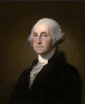

# voteview member_photos repo 

This repository contains photos of U.S. congressional representatives through the ages, as well as code necessary to regenerate this data from scratch. We currently have approximately *9,700* of *12,300* representatives accounted for including every member serving since 1955.

This project is a part of [voteview.com](https://voteview.com), a website dedicated to providing information about historical U.S. legislators, including NOMINATE ideological scores, historical roll-call votes, and biographical information. [voteview.com](https://voteview.com) is a project of University of California Los Angeles' Department of Political Science. The corresponding maintainer for this repository is [Aaron Rudkin](https://github.com/aaronrudkin/).

## How to Use

### Using the images

`members.csv` contains a list of all members we have photos for at the time the file was generated. This will allow you to map familiar names to the ICPSR IDs that index our photo filenames. The file is sorted by most recent congress served, then alphabetically. The photos presented are scaled to 600px in height, 4x5 aspect ratio. Files smaller than 600px in height are not upscaled, and images very near 4x5 aspect ratio are not cropped.

Example results:

Name | ICPSR | State | Party | Congress | Chamber | Born | Died | Image | Source | Provenance
-----|-------|-------|-------|----------|---------|------|------|-------|--------|------------
WELLSTONE, Paul David | 049101 | Minnesota | Democratic Party | 107 | Senate | 1944 | 2002 | images/bio_guide/049101.jpg | bio_guide | 
CLINTON, William Jefferson (Bill) | 099909 | President | Democratic Party | 106 | President | 1946 | | images/wiki/099909.jpg | wiki | 
GUILL, Ben Hugh | 003874 | Texas | Republican Party | 81 | House | 1909 | 1994 | images/manual/003874.jpg | manual | [Representing Texas](https://books.google.com/books?id=-14gbMQftG0C)

### Check for Missing

`check_missing.py` allows users to check for representatives whose photos are missing and generates a table based on criteria provided.

Arguments:

* `--type flat`: Use a flatfile database instead of our default MongoDB instance. Most end users should use this argument.
* `--min N`: Provide a number `N` which represents the minimum Congress to scan for missing photos (default `81` [1947-1949])
* `--chamber chamber`: Province a chamber `chamber` describing a specific chamber of congress. Valid options are `House` or `Senate`. Default is left blank.
* `--state state`: Province a two-character `state` postal abbreviation to limit searches to one state. Example: `CO` for Colorado.
* `--sort sort`: Provide a string `sort` which describes which field to sort on. Valid options are `bioname`, `icpsr`, `state_abbrev`, `party_code`, `congress`. Default is `congress`.
* `--year`: If specified, table will include "year" instead of "congress" and the `--min` argument will expect a year.
* `--raw`: If specified, the script will check for images where we have processed copies, but no raw copies. Clones of the repository that have not yet re-scraped the raw files from `bio_guide` and `wiki` should see all such images; clones of the repository that have scraped images should report no missing raw files.

Example usage:

`python check_missing.py --type flat --min 50 --state CT --chamber House --sort bioname`

### Scrape Congressional Bioguide

`bio_guide.py` allows users to scrape the [Congressional Bioguide](http://bioguide.congress.gov/biosearch/biosearch.asp) for photos.

Arguments:

* `--type flat`: Use a flatfile database instead of our default MongoDB instance. Most end users should use this argument.
* `--min N`: Provide a number `N` which represents the minimum Congress to scan for missing photos (default `20`)

Example usage:

`python bio_guide.py --type flat --min 50`

### Scrape Wikipedia

`wiki.py` allows users to scrape Wikipedia for photos.

Arguments:

* `--type flat`: Use a flatfile database instead of our default MongoDB instance. Most end users should use this argument.
* `--min N`: Provide a number `N` which represents the minimum Congress to scan for missing photos (default `20`)
* `--icpsr ICPSR --url "http://..."`: Provide an ICPSR and a URL to manually scrape a Wikipedia article for that ICPSR. Useful when the default name or search is inadequate. The resulting page will still be checked against the scoring algorithm to ensure the page is appropriate for the member.
* `--blacklist ICPSR`: Mutually exclusive to all other arguments; tells the scraper to not scrape this ICPSR from Wikipedia in the future. Useful when the correct page has a photo that is incorrectly scraped (i.e. house or memorial photo or military insignia instead of photo of person).

Example usage:

`python wiki.py --type flat --min 50`

`manual_wiki_override.sh` will scrape photos for all our currently known cases where the default scraper scrapes an incorrect photo or misses the search query.

### Manual Photos

Some photos were collected manually from other sources. In addition to distributing the already-resized versions of these, raw versions of these photos (best available quality/resolution) are stored in `images/raw/manual/`. Information about where each of these images came from is stored in `config/provenance.json`. These images are automatically downsampled and cropped when running the processing steps below.

### Process Photos

* `constain_images.sh` will resice, format size, and optimize images. Images will move from `images/raw/<source>/<file>.<ext>` to `images/<source>/<file>.jpg`. Running `constrain_images.sh` will require you to install [smartcrop-cli](https://github.com/jwagner/smartcrop-cli) -- this is used for intelligent cropping of portrait images with facial detection.
* `scrape_all.sh` will scrape Bioguide, Wikipedia, perform the manual Wikipedia overrides, and then constrain the images in order. This should generate the repository essentially as-is from scratch.

### Configuration

* `config/config.json`: User-Agent for scraper and some default URLs.
* `config/bio_guide_results.json`: Blacklist for Congressional bioguide.
* `config/wiki_results.json`: Blacklist for Wikipedia and greylist (articles recently scraped, confirmed to contain nothing, skip for a while)
* `config/parties.json`: Party metadata, used for both checking Wikipedia articles and outputting party names.
* `config/states.json`: State metadata, used for both checking Wikipedia articles and outputting party names.
* `config/database-raw.json`: Large raw database dump, used for flat-file searches.

### Behind the Scenes:

* `config/dump_db.py`: Dumps current database to flatfile. Requires our local MongoDB instance.
* `config/dump_csv.py`: Dumps the current images to a `members.csv` file. Can take `--type flat` to dump from flat file.

## Contributing

We welcome contributions of photos or code improvements. For code improvements, please open a pull request.

For sources for photos, please see our [Issues](https://github.com/voteview/member_photos/issues) page. If you are contributing a photo to an existing project, just reply with a comment including the photo (highest resolution possible, include information about where the photo is from and any rights issues). If no project seems applicable, or if you are letting us know about a new source of many photos, please open a new Issue. We believed that the use of low resolution images of historical public figures, freely obtained largely from public domain or government sources, constitutes fair use. Please ensure that any images you suggest are cleared for use by voteview.com and users of this repository.

## Next Steps

1. `deploy.sh` to deploy downscaled images to production environment.
